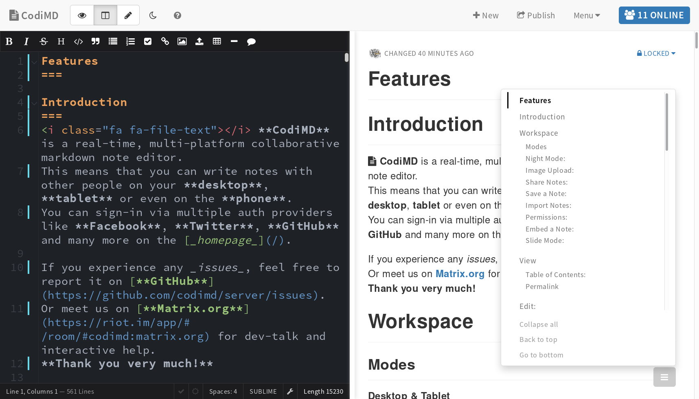

# CodiMD

> The best platform to write and share markdown.

## About CodiMD
CodiMD lets you create real-time collaborative markdown notes.  
It is a node-js based web application. 
You can test-drive it by visiting our [CodiMD demo server](https://demo.codimd.org).
It is inspired by Hackpad, Etherpad and similar collaborative editors.  
This project originated with the team at [HackMD](https://hackmd.io) and now forked into its own organisation. A longer writeup can be read in the [history doc](history.md).

## Features
- Live collabaration via URL
- Permission system
- Login via Facebook, Twitter, GitHub, GitLab, Dropbox, Google, SAML, OAuth2 and LDAP configurable
- Dropbox import and export
- Embedding of YouTube, Vimeo, Gists, pdfs
- Many types of diagrams and GraphViz-support
- To-do-lists
- Code syntax highlighting

## Installation / Hosting
You can run CodiMD in a number of ways. These include:
- Docker
- Kuberentes
- Cloudron
- LinuxServer.io
- Heroku
- Manual setup

See [setup](/setup/) for instructions.

If you do not wish to run your own setup, you can find a commercial offering at
[hackmd.io](https://hackmd.io). This is not the same codebase as this one, but it is a very
similar project.

## Community and Contributions
We welcome contributions! There's a lot to do: If you would like to report bugs,
the [issue tracker][github-issue-tracker] is the right place. If you can help
translating, find us on [POEditor][poeditor-url]. To get started developing,
take a look at the [developer guides](/dev/). In any case: come talk to us,
we'll be delighted to help you with the first steps.

To stay up to date with our work or get support it's recommended to join our
[Matrix channel][matrix.org-url], stop by our [community forums][codimd-community]
or subscribe to the [release feed][github-release-feed]. 

## Related Tools
Our community has created related tools, we'd like to highlight [codimd-cli](https://github.com/codimd/cli)
which lets you use CodiMD from the comfort of your command line.

## License
Licensed under AGPLv3.

[matrix.org-url]: https://riot.im/app/#/room/#codimd:matrix.org
[github-release-feed]: https://github.com/codimd/server/releases.atom
[github-issue-tracker]: https://github.com/codimd/server/issues
[poeditor-url]: https://poeditor.com/join/project/1OpGjF2Jir
[codimd-community]: https://community.codimd.org
