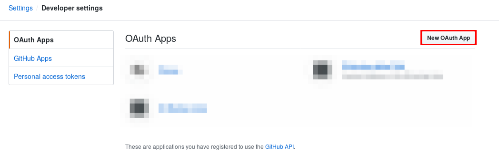
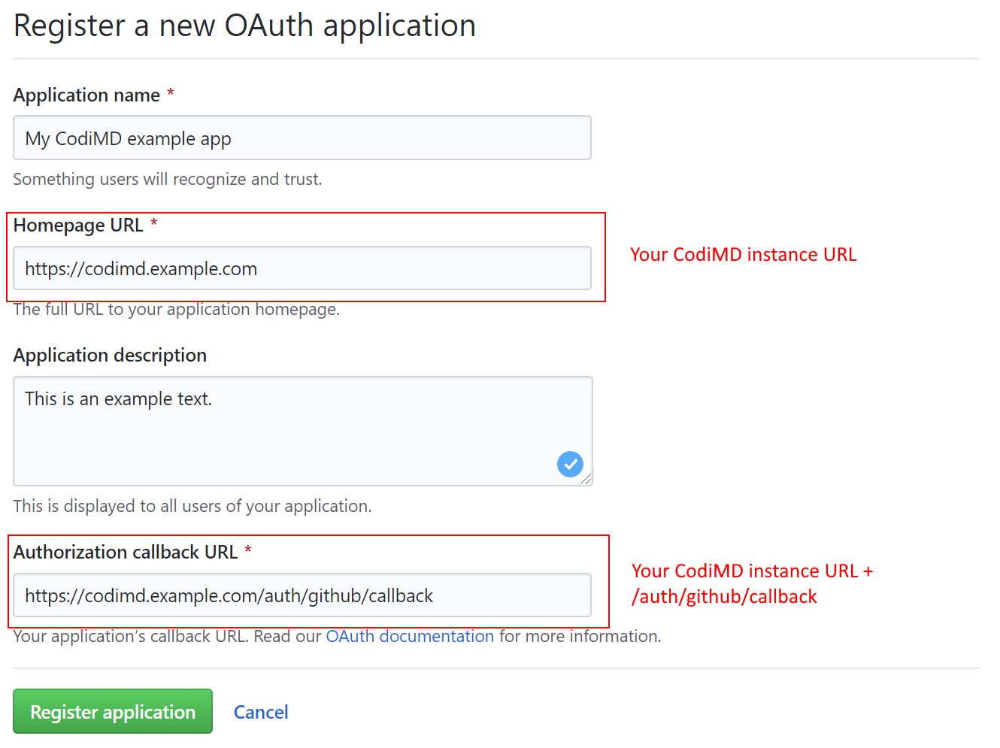
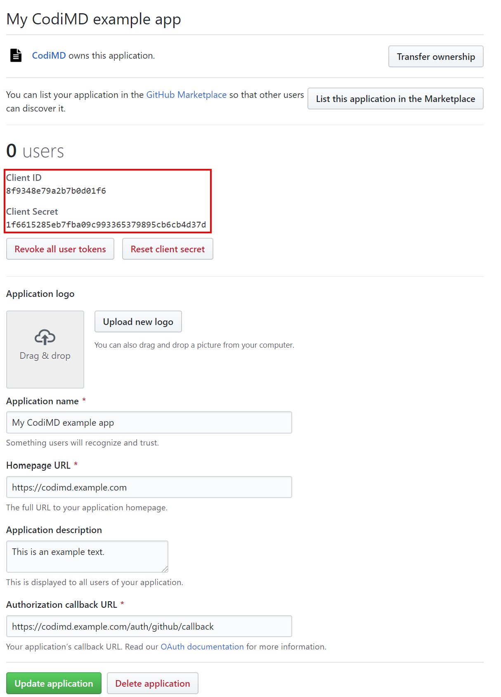

# Integrate GitHub authentication

1. Sign-in or sign-up for a GitHub account.
2. Navigate to OAuth app settings in your GitHub account [here](https://github.com/settings/developers).
3. Click on the **New OAuth App** button, to create a new OAuth App.  
   
4. Fill out the new OAuth application registration form, and click **Register Application**.  
   

   **Note:** *The callback URL is `<your-codimd-url>/auth/github/callback`*

5. After successfully registering the application, you'll receive the client ID and client secret for the application.  
   

6. Add the client ID and client secret to your config.json file **or** pass them as environment variables.
    * `config.json`:
      ```json
      {
        "production": {
          "github": {
              "clientID": "38f9348e79a2b7b0d01f6",
              "clientSecret": "1f6615285eb7fba09c993365379895cb6cb4d37d"
          }
        }
      }
      ```
    * environment variables:
      ```sh
      CMD_GITHUB_CLIENTID=38f9348e79a2b7b0d01f6
      CMD_GITHUB_CLIENTSECRET=1f6615285eb7fba09c993365379895cb6cb4d37d
      ````
