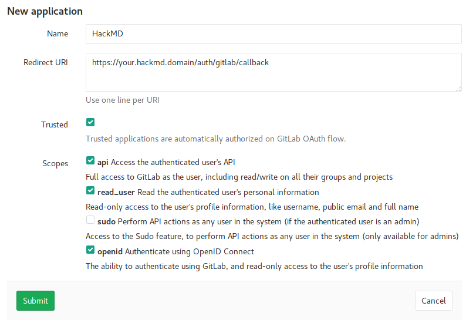
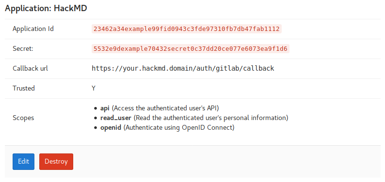

# Integrate GitLab (self-hosted) for authentication

**Note:** *This guide was written before the renaming. Just replace `HackMD` with `CodiMD` in your mind :smile: thanks!*

1. Sign in to your GitLab instance.
2. Navigate to the application management page at `https://your.gitlab.domain/admin/applications` (admin permissions required).
3. Click **New application** to create a new application and fill out the registration form:  
   

4. Click **Submit**.
5. In the list of applications select **CodiMD**. Leave that site open to copy the application ID and secret in the next step.  
   

6. Update either your `config.json` **or** set the equivalent environment variables.

    * `config.json`:
      ```json
      {
        "production": {
          "gitlab": {
              "baseURL": "https://your.gitlab.domain",
              "clientID": "esTCJFXXXXXXXXXXXXXXXXXXX",
              "clientSecret": "zpCs4tU86pRVXXXXXXXXXXXXXXXXXXXXXXXXXXXXXXXXXXXXXX"
          }
        }
      }
      ```
      
    * environment variables:
      ```sh
      CMD_GITLAB_BASEURL=https://your.gitlab.domain
      CMD_GITLAB_CLIENTID=23462a34example99XXXXXXXXXXXXXXXXXXXXXXXXXXXXXXX
      CMD_GITLAB_CLIENTSECRET=5532e9dexamplXXXXXXXXXXXXXXXXXXXXXXXXXXXXXXXXXXXXX
      ```
