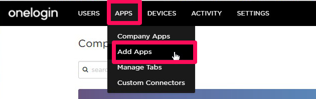
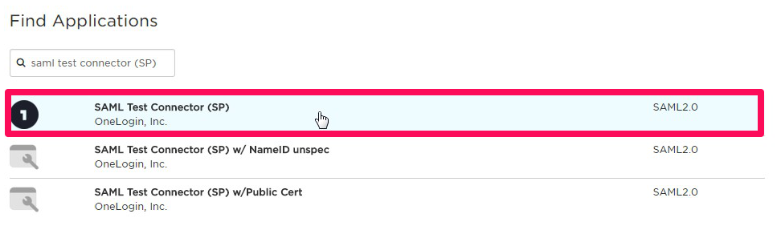
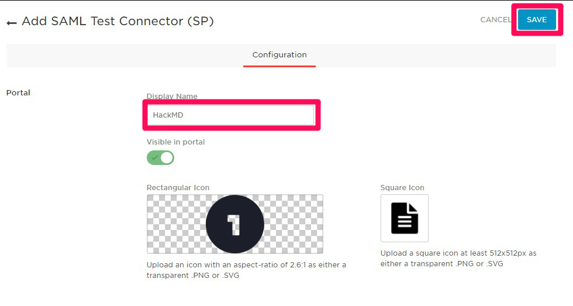
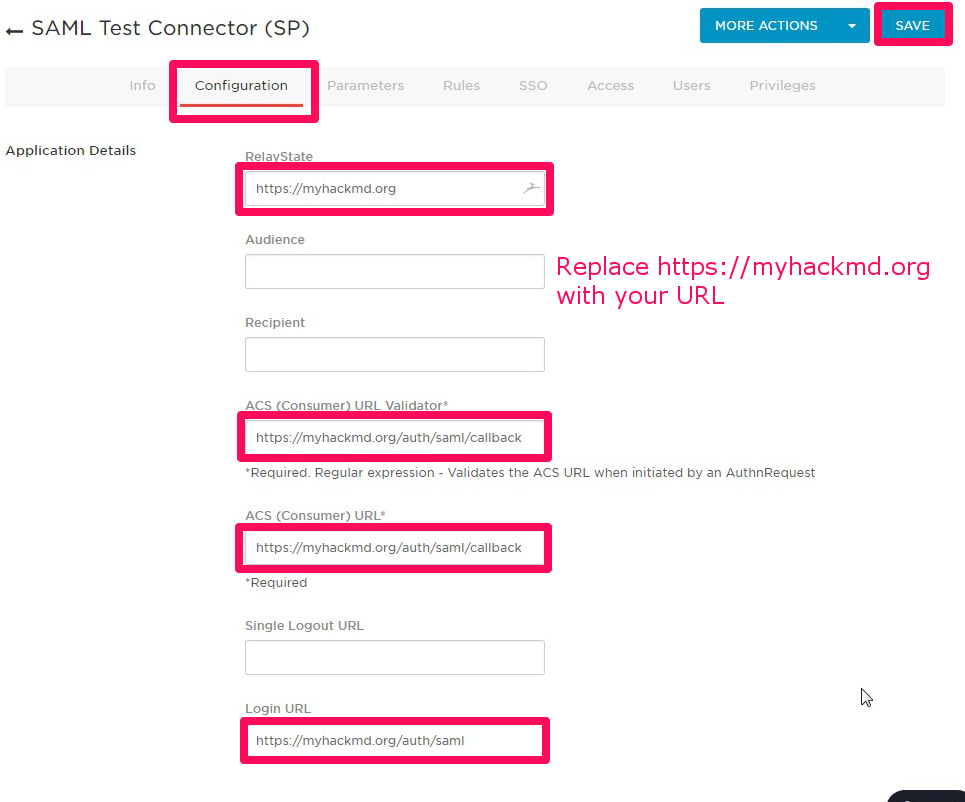
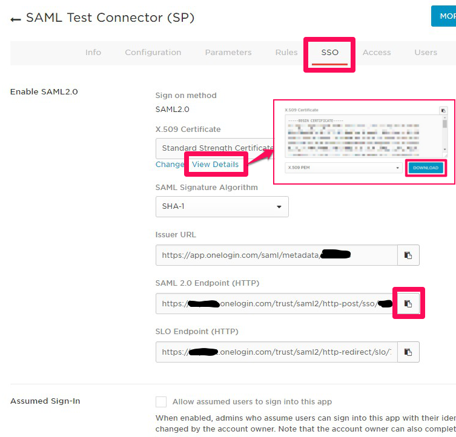
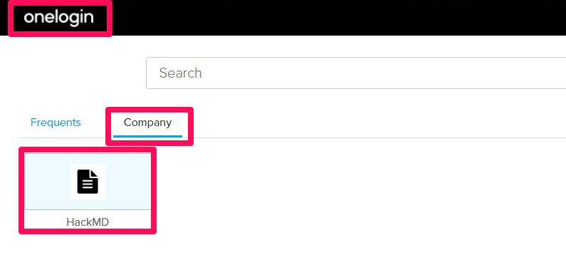

# Integrate OneLogin authentication (via SAML)

**Note:** *This guide was written before the renaming. Just replace `HackMD` with `CodiMD` in your mind :smile: thanks!*

1. Sign-in or sign-up for an OneLogin account [here](https://www.onelogin.com/free-trial). There is a free trial version available that lasts 30 days.
2. Go to the administration page.
3. Select the **APPS** menu and click on the **Add Apps**.  
   

4. Find "SAML Test Connector (SP)" for template of settings and select it.  
   

5. Edit display name and icons for OneLogin dashboard as you want, and click **SAVE**.  
   

6. After that other tabs will appear, click the **Configuration**, and fill out the below items, and click **SAVE**.
    * RelayState: The base URL of your CodiMD instance, which is issuer. (last slash is not needed)
    * ACS (Consumer) URL Validator: The callback URL of your CodiMD. instance (`serverurl + /auth/saml/callback`)
    * ACS (Consumer) URL: same as above.
    * Login URL: login URL(SAML requester) of your CodiMD instance. (`serverurl + /auth/saml`)  
      

7. The registration is completed. Next, click **SSO** and copy or download the items below.
    * X.509 Certificate: Click **View Details** and **DOWNLOAD** or copy the content of certificate ....(A)
    * SAML 2.0 Endpoint (HTTP): Copy the URL ....(B)  
      

8. In your CodiMD server, create IdP certificate file from (A)
9. Add the IdP URL (B) and the Idp certificate file path to your config.json file or pass them as environment variables.
    * `config.json`:
      ```json
      {
        "production": {
          "saml": {
            "idpSsoUrl": "https://*******.onelogin.com/trust/saml2/http-post/sso/******",
            "idpCert": "/path/to/idp_cert.pem"
          }
        }
      }
      ```
    * environment variables
      ```sh
      CMD_SAML_IDPSSOURL=https://*******.onelogin.com/trust/saml2/http-post/sso/******
      CMD_SAML_IDPCERT=/path/to/idp_cert.pem
      ```
10. Try sign-in with SAML from your CodiMD sign-in button or OneLogin dashboard (like in the screenshot below).  
   
