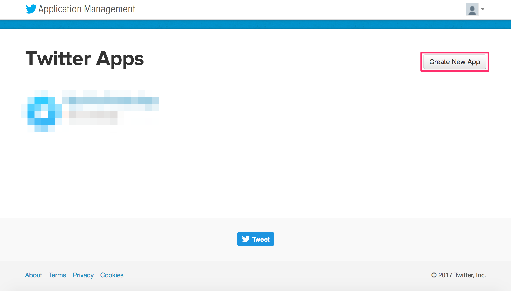
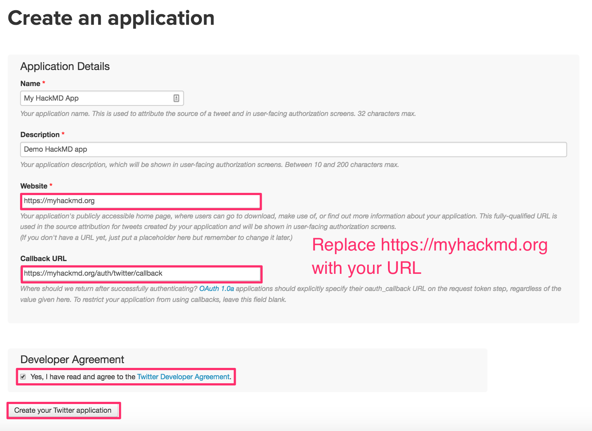
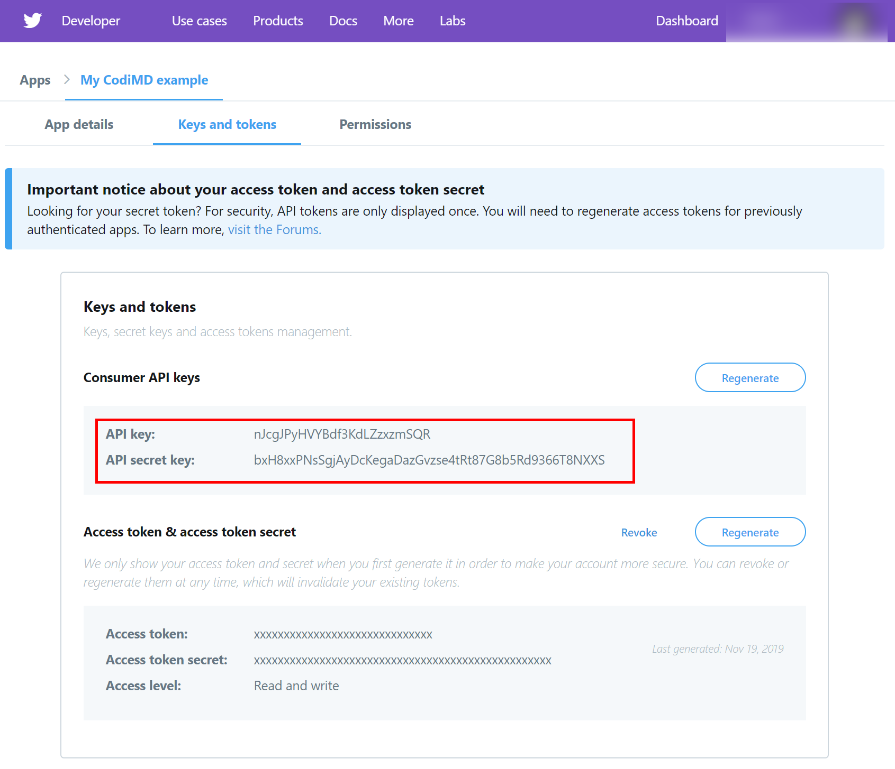

# Integrate Twitter authentication

*Note: You might need to register your account as developer account before creating an app. You will see a prompt with details about that at your first visit in the Twitter developer tools.*

1. Sign-in or sign-up for a Twitter account.
2. Go to the Twitter Application management page [here](https://developer.twitter.com/apps).
3. Click on the **Create an app** button to create a new Twitter app:  
   

4. Fill out the create application form and click **Create**  
   

5. After you receive confirmation that the Twitter application was created, click **Keys and tokens** to obtain your consumer API key and secret:  
   

6.  Add your Consumer Key and Consumer Secret to your `config.json` file **or** pass them as environment variables:
    * `config.json`:
      ```json
      {
        "production": {
          "twitter": {
              "consumerKey": "esTCJFXXXXXXXXXXXXXXXXXXX",
              "consumerSecret": "zpCs4tU86pRVXXXXXXXXXXXXXXXXXXXXXXXXXXXXXXXXXXXXXX"
          }
        }
      }
      ```
    * environment variables:
      ```sh
      CMD_TWITTER_CONSUMERKEY=esTCJFXXXXXXXXXXXXXXXXXXX
      CMD_TWITTER_CONSUMERSECRET=zpCs4tU86pRVXXXXXXXXXXXXXXXXXXXXXXXXXXXXXXXXXXXXXX
      ```
